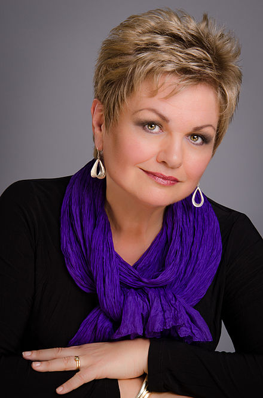

# Friends of the South London Singers

How to support us by joining our network of Friends of the South London Singers

# Becoming a Friend of the SLS

By signing up to be a Friend of the SLS, not only will you be safeguarding the future of the choir, you'll also be able to take advantage of perks offered to our Friends network.

You'll get discounted or free entry to our concerts and selected social events.

Your support will also mean that we can explore exciting opportunities for the choir to engage the local community in new ways. We aim to give the next generation of local choral musicians the opportunity to learn and develop their skills with us and enhance the musical life of Beckenham well into the future.

Choir members can also sign up to be Friends of the SLS, at a discounted rate of 50%.

The choir extends our warmest thanks to our current Friends: Roger Wibberley, Alan Duncan, Monica Duncan, Jenny Carrington, Christiane Tod, Comfort Lawson and Jane & David Davies.

You can sign up to Bronze, Silver or Gold level membership:

## Bronze

- £60 per year OR £5 per month 

- Discounted entry to all SLS concerts 

- Quarterly e-newsletter 

- Name listed on the SLS website 

- Discounted entry to the annual Friends' Celebration Evening

## Silver

- £120 per year OR £10 per month 

- FREE entry to all SLS concerts 

- Quarterley e-newsletter 

- Name listed on the SLS website 

- Reserved seat of your choice at SLS concerts 

- Discounted refreshments at all SLS events 

- FREE entry to annual Friends Celebration Evening

## Gold

- £210 per year OR £17.50 per month
- FREE entry to all SLS concerts
- Quarterly e-newsletter
- Name listed on SLS website and concert programmes
- Reserved seat of your choice at SLS concerts
- FREE refreshments at all SLS events
- Seated at the President's table at the annual Friends Celebration Evening
- FREE entry into the prize draw at the annual Friends Celebration Evening

## Susan Bullock CBE - President of the Friends

I am so happy that musical groups are becoming active again in the local community. I am very pleased to be supporting the SLS as the first President of the Friends.

## Other ways to support our choir

We welcome support in lots of ways!

### Come and hear us

We are always keen to welcome new audience members to our concerts. Find out how to [buy tickets here.](box-office)

### Join the choir

We would love to welcome new members. Find out how to attend a no-commitment [trial rehearsal here](join-us).

### Subscribe to our mailing list

Get the latest information about our upcoming concerts and other social events in and around Beckenham and pass it on to your friends and family! We'll only ever contact you about our local events and updates, and will never pass your information on to a third party.

## Get our emails

- indicates required

Email Address *

First Name

Last Name

Marketing Permissions

South London Singers will only ever contact you with details of our upcoming events, and will never pass your information to any third party. Opt in to our emails here:

Email

You can unsubscribe at any time by clicking the link in the footer of our emails. For more information about our privacy practices, please contact us.

We use Mailchimp as our marketing platform. By clicking below to subscribe, you acknowledge that your information will be transferred to Mailchimp for processing. [Learn more about Mailchimp's privacy practices here.](https://mailchimp.com/legal/terms)

## Address

South London Singers, Care of 39 Balfour Road, South Norwood, London, SE25 5JY

## Call Us

Membership Secretary: 
Mary: 020 8656 2815

## Email Us

<info@southlondonsingers.com>
