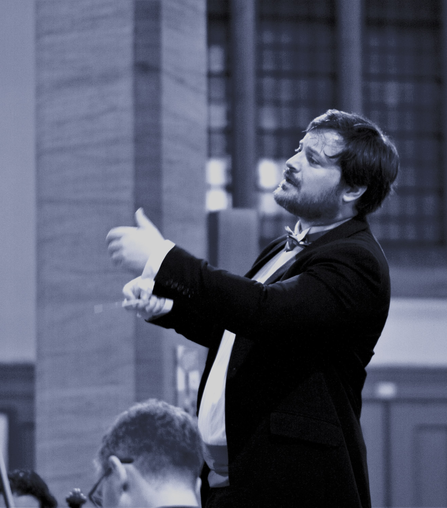
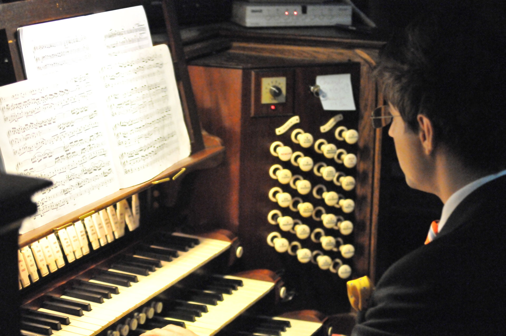

# Music Director: Christopher Braime

For over 20 years, Christopher Braime has been a freelance conductor working with professional ensembles and championing community music throughout the United Kingdom and Europe. Christopher is the musical director of the London Gay Symphony Orchestra, the South London Symphonic Winds and the South London Sinfonia. From January 2025, we are pleased to welcome him into his new role as music director of the South London Singers.

Through his new role as Director of Music at St Lukes, Woodside, he is committed to creating opportunities for young people and adults to access music who would otherwise miss out on this vital experience.

# Accompanist: Jack Stone

Jack Stone was a student of Chetham's School of Music, graduate of the Royal College of Music (where he received the 2016 Harold Darke Prize), and is an Associated Member of the Royal College of Organists. Jack has held accompanist posts at Dean Close School, Cheltenham; Tewkesbury Abbey; Carlisle Cathedral; Chelsea Ballet School; Morley Opera School and Regents Opera. He is currently Director of Music at Catford Parish Church, Accompanist of the South London Singers, repetiteur for Lewisham Urban Opera, a visiting accompanist for Morley College and a freelance vocal coach and recitalist.
